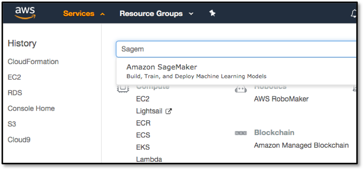
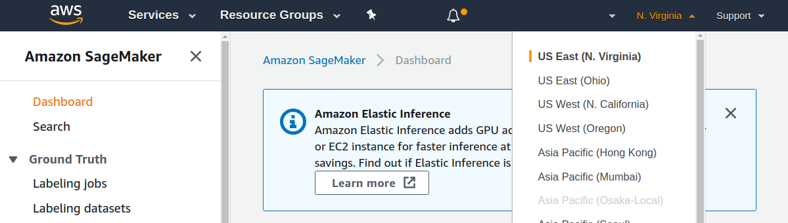
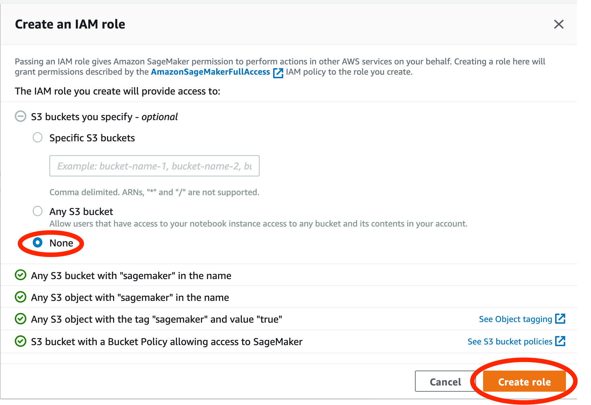
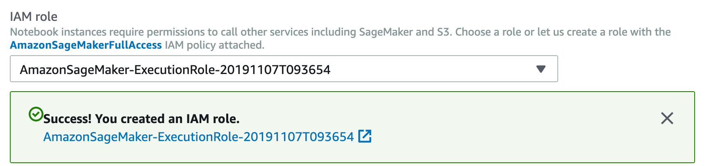
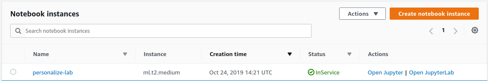
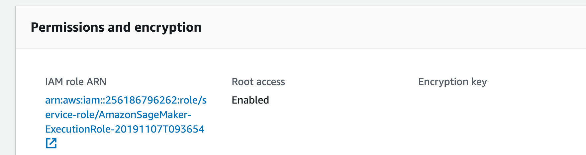
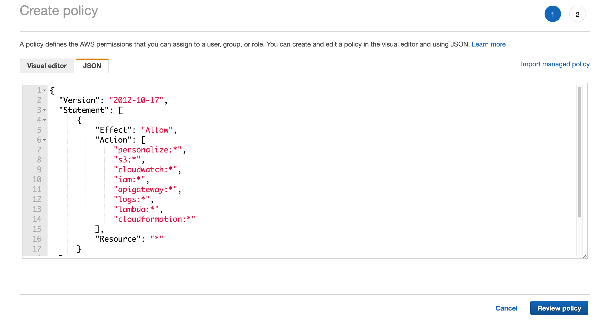
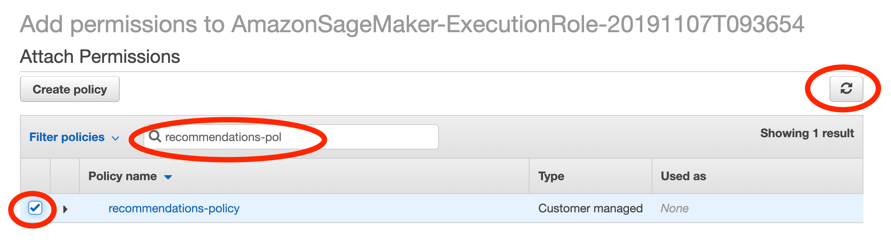
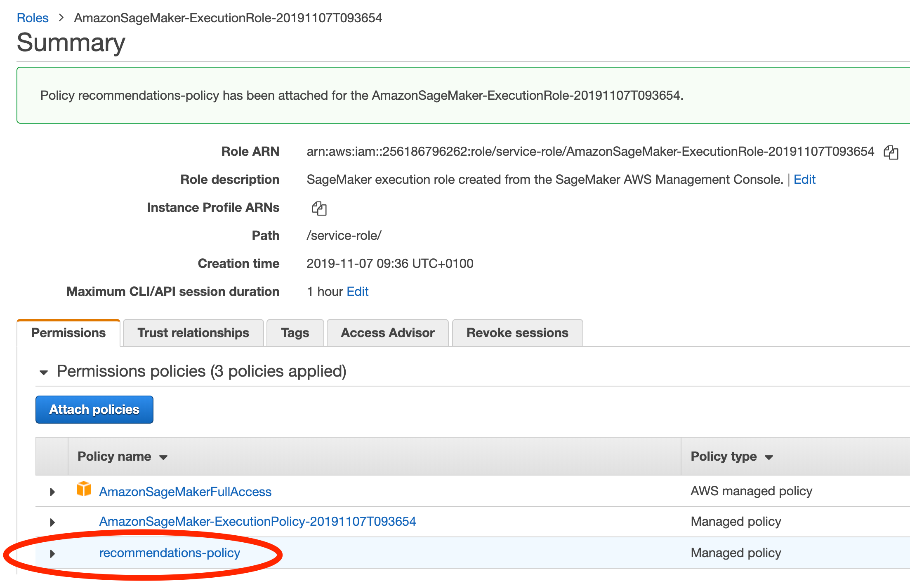
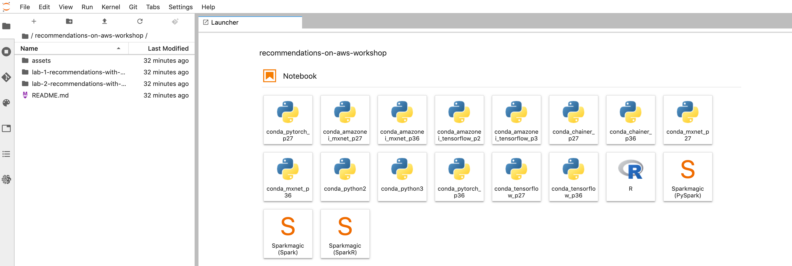

# Lab 0 - Setting up your Amazon SageMaker Jupyter notebook instance

## Overview

Throughout this workshop we will use a Amazon SageMaker Jupyter notebook instance to interactively execute code required to train and deploy our models. [Jupyter](https://jupyter.org/) is an open-source web application that allows you to create and share documents that contain live code, visualizations and narrative text.

In this lab we will set up our Jupyter notebook instance so it can be used in the following labs.

## Launching a Jupyter Notebook using Amazon SageMaker

1. Click on **Amazon SageMaker** from the list of all services by entering _Sagemaker_ into the **Find services** box. This will bring you to the Amazon SageMaker console homepage. In another browser tab or window, navigate to the **IAM** console homepage, as we'll need that shortly.

   

1. We'll be doing our Lab today in the North Virginia region (us-east-1). Please make sure that you are working within this region by slecting it from the drop down list on the top right of the console.

   

1. To create a new Jupyter notebook instance, go to **Notebook instances** in the Amazon SageMaker console, and click the **Create notebook instance** button at the top of the browser window.

   Type _[Name]-lab-notebook_ into the **Notebook instance name** text box, and then _ml.t2.medium_ into the **Notebook instance type** field. Note, for this workshop the majority of the work is performed by either Amazon Personalize or Amazon Sagemaker Training jobs and not by your notebook instance, so there is no need to launch a large, compute-optimized C5 or GPU-based instance type - please just use the instance type specified here, as that's all that you need, and using these more powerful, more expensive instance families will not actually help you to complete the workshop any faster.

1. In the IAM role dropdown select `create new role`. In the popup select None for `S3 buckets you specify` and select `create role`, like shown here:

   

   Once the role is created it should look like this:

   

1. Expand out the optional Git repositories section (note that this step is not optional for the purposes of this workshop).

   - Select ‘Clone a public Git repository to this notebook instance only’
   - Paste `https://github.com/johanneslanger/recommendations-on-aws-workshop.git` into the Git Repository URL field
   - Now your instance will launch with the latest version of these workshops already on it, in a folder called `recommendations-on-aws-workshop`
   - You can also add shared repositories if you would like your colleagues to all have access to shared libraries etc

1. Scroll down and click on **Create Notebook Instance**

## Assigning permissions to the notebook instance

Next we need to ensure we assign the required permission to the notebook instance. This ensures we can successfully call the AWS services required for this workshop. To do this we need to attach a custom policy to the IAM role of the notebook instance.

1. Start by selecting the notebook instance properties by clicking the name of the instance:
   

1. Next under `Permissions and encryption` select the role to be redirected to IAM:
   

1. Now select `Attach policies` --> `Create policy` and select the `JSON` tab. Finally paste following JSON into the inline editor.

   **Note: the permissions granted here are overly permissive to enable quick experimentation in this workshop and should not be used for production. In a production setting you would scope down permissions to a minimal set (Least privilege principle).**

   ```json
   {
     "Version": "2012-10-17",
     "Statement": [
       {
         "Effect": "Allow",
         "Action": [
           "personalize:*",
           "s3:*",
           "cloudwatch:*",
           "iam:*",
           "apigateway:*",
           "logs:*",
           "lambda:*",
           "cloudformation:*"
         ],
         "Resource": "*"
       }
     ]
   }
   ```

   It should look like this:

   

1. Select `Review policy`and type in `recommendations-policy`into the name field. Then select `Create policy`

1. Now we need to go back to the previous browser tab, which allowed you to attach a policy to our role. If you don't have it open anymore, just navigate back to the SageMaker instance properties, select the IAM role from there and select attach policy (Step 3-4).

1. In the filter type in "recommendations" and select the policy. You might have to hit the refresh button if the policy does not show up.

   

1. Finally hit `Attach policy`and you should see a confirmation that the policy has been attached:

   

## Accessing your notebook instance

1. Go back to `SageMaker` --> `Notebook instances`

1. If required, wait until the notebook instance status is **InService**. This will take a few minutes once the creation process has started. Then click on **Open JupyterLab**

   

1. You will be taken to your newly created Jupyter Notebook instance, with our git repo cloned into it. (see file browser on the left)

   

## Next steps

Congratulations you are all set to start your first lab. If you are new to Jupyter, don't worry, we will cover the basics in the first lab!

[Proceed to Lab 1](../lab-1-recommendations-with-amazon-personalize)
