    

**Last Updated:** November 2019

# Personalize Your Recommendations

## Overview

Amazon Personalize is a machine learning service that makes it easy for developers to create individualized recommendations for customers using their applications.

Machine learning is being increasingly used to improve customer engagement by powering personalized product and content recommendations, tailored search results, and targeted marketing promotions. However, developing the machine-learning capabilities necessary to produce these sophisticated recommendation systems has been beyond the reach of most organizations today due to the complexity of developing machine learning functionality. Amazon Personalize allows developers with no prior machine learning experience to easily build sophisticated personalization capabilities into their applications, using machine learning technology perfected from years of use on Amazon.com.

This lab will walk you through the following:

- Deploy and configure a *Video Recommendation* application
- Setting up a Jupyter Notebook environment for the Amazon Personalize Service Preview
- Downloading and preparing training data, based on the Movie Lens 100k data set
- Importing prepared data into Amazon Personalize
- Building an ML model based upon the Hierarchical Recurrent Neural Network algorithm (HRNN)
- Testing your model by deploying an Amazon Personalize campaign
- Adding your campaign to Video Recommendation application

# Deploy the Video Recommendation App

## Deploy the "Video Recommendation" Application

1. Whilst this application could be deployed anywhere, it uses both an EC2 Amazon Machine Image (AMI) and RDS Snapshot that have been stored in the North Virgina Region of AWS (us-east-1).  Hence, please make sure that the Region selected in the AWS Console is alway **US East (N.Virginia)**, as shown in the following diagram.  The workshop will only function correctly if the EC2 configuration, CloudFormation template executiion and SageMaker notebook are all using this AWS Region.

  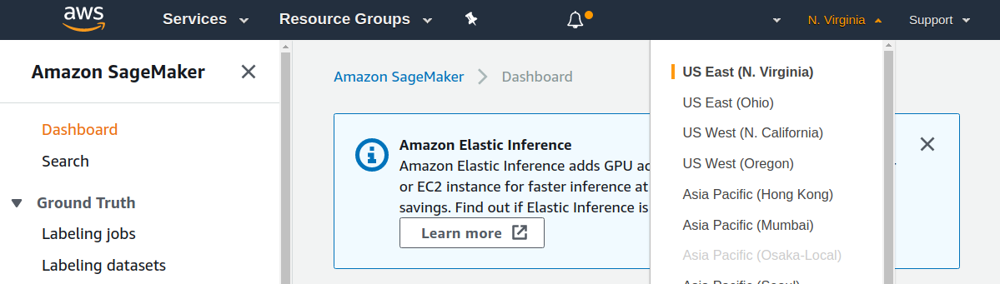

2. The appication will run on an EC2 instance, but at some point we will need to connect to the server in order to carry out some configuration task.  To do this we need to have an *EC2 Key Pair* configured on the server that you also have access to on your computer; hence, we need to create and download a new one.  Click on **EC2** from the list of all services by entering EC2 into the Find services box.  This will bring you to the Amazon EC2 console home page.

  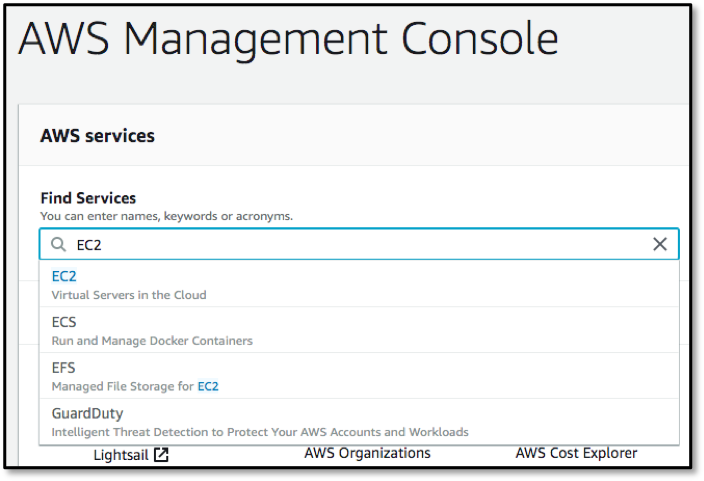

3. On the left-hand menu scroll down until you see **Key Pairs** and select it, and in the resulting dialog click on the **Create Key Pair** button.  This will bring up a **Create Key Pair** dialog, where you need to enter the name of a new key pair - call it *myLabKey* and hit **Create**.  This should automatically download the file, or you may need to manually do so.

  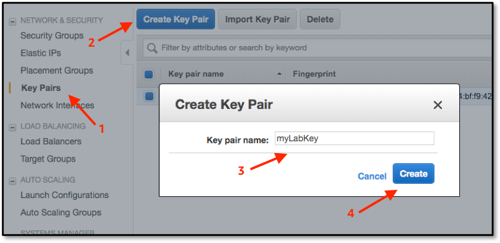

4. **Optional** - should you wish to later SSH in to your instance, you need to have your downloaded key-pair from earlier in an accessible location.  It also must not be publicly readable, so if you are on a Mac or Linux system you can fix this with the following command run from the folder where you stored the key, remembering to replace **myLabKey.pem** with your key name!

  ```bash
  $ chmod 400 myLabKey.pem
  ```

5. Click on the **Services** dropdown and select **CloudFormation** from the list of all services by entering CloudFormation into the Find services box.  This will bring you to the Amazon CloudFormation console home page.

  

6. We are going to deploy a pre-built application via a CloudFormation template - this will be a fully-functioning recommendation system, allowing access to multiple Amazon Personalize features.  But it has one drawback - there are no models built into it!  So we will create them in this lab, and when they are ready we will re-configure this application to use them. But first we need to deploy this skeleton application but downloading this file from the workshop repository.  Right-click on the following link and download the template to a file on your local computer, remembering to keep it as a text file with a **.yml** extention.

  https://raw.githubusercontent.com/drandrewkane/AI_ML_Workshops/master/lab-6-Personalize_your_Recommendations/cloudformation_template.yml

7. Click on the **Create Stack** button to start the deployment wizard, and in the **Specify template** section select **Upload a template file**, click on the **Choose file** button, and select the template file that you just downloaded.  Then click on **Next**.

  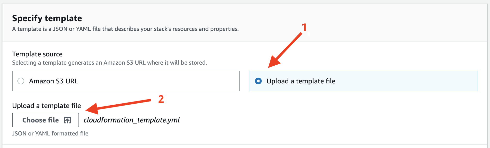

8. The next screen asks for more configuration parameters, but only a few of these are required.  Enter you values for the following, then click **Next** when you're done - you are free to enter new values for the *DjangoAdminLogin* or *DjangoEmailAddress*, but the defaults for these and other parameters are fine.

  1. **Stack name** - enter something simple, as as *LabStack*
  2. **Parameter - DjangoAdminPassword** - enter a password of your choice
  3. **Parameter - KeyName** - select your previously-defined EC2 kay-pair

9. There then follows two more screens.  The first is called *Options*, but we have none to enter so just click on **Next**.  The second is the final *Review* screen - verify the parameters, hit the checkbox next to the statement *"I acknowledge that AWS CloudFormation might create IAM resources with custom names."* and then click on **Create stack**.  This will then go and create the environment, which will take around 10-15 minutes minutes.  Unfortunately, we are creating IAM resources, so we cannot continue until it has completed - so read ahead and get a feel for what's coming up next. 

# Setup your Jupyter Notebook environment

## Launching a Jupyter Notebook using Amazon SageMaker

1. Click on **Amazon SageMaker** from the list of all services by entering *Sagemaker* into the **Find services** box.  This will bring you to the Amazon SageMaker console homepage.  In another browser tab or window, navigate to the **IAM** console homepage, as we'll need that shortly.


2. To create a new Jupyter notebook instance, go to **Notebook instances** in the Amazon SageMaker console, and click the **Create notebook instance** button at the top of the browser window.

   Type _[Name]-lab-notebook_ into the **Notebook instance name** text box, and then _ml.t2.medium_ into the **Notebook instance type** field.  Note, for this lab the majority of the work is performed by the Amazon Personalize service and not by your notebook instance, so there is no need to launch a large, compute-optimized C5 or GPU-based instance type - please just use the instance type specified here, as that's all that you need, and using these more powerful, more expensive instance families will not actually help you to complete the workshop any faster.

3. In the _IAM role_ field in **Permissions and encryption** section choose _Enter a custom IAM role ARN_.  Now go over into your open **IAM** tab or window, click in the *Search IAM* field, and then enter **AmazonLab** as the search term.  Select the full role name for SageMaker, being careful not to select the *Delete* or *Edit* options.

   

4. On the resulting detail screen copy the **Role ARN** value - this role will give your SageMaker notebook sufficient IAM priviledges, and full access to both the Personalize and S3 services.  Note, for a Production system you would most likely restrict this role to specific S3 buckets as per your internal requirements, but this workshop allows access to any S3 bucket.  You can now close this tab or window

5. Go back to your SageMaker screen, and in the *Custom IAM role ARN* field paste in the IAM ARN that you copied in the previous step, scroll down and click on **Create Notebook Instance**

6. Wait until the notebook instance status is **InService**. This will take a few minutes once the creation process has started.  Then click on **Open Jupyter** - whilst you're waiting you can perform step #1 of the next section to copy some files from Git

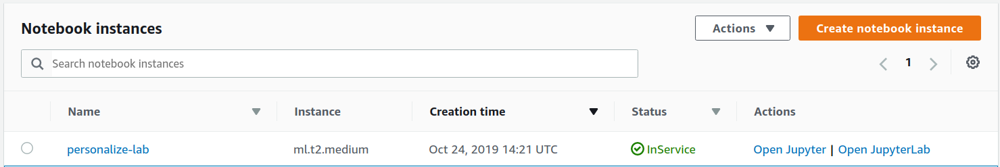

### Downloading required additional files

We need to download two files before starting work, which are all stored within the Lab's Git repository:

- the Notebook file that contains the lab - **personalize_sample_notebook.ipynb**
- a file that is part of the MovieLens dataset - **u.item** - that has been edited slightly to remove some control characters that cause on of the _pandas_ library calls to fail, and also to include working URLs for the various movie posters that our application will show later

1. Go to the Git repository address, https://github.com/drandrewkane/AI_ML_Workshops, navigate to the **Lab 6** and download the files called **u.item** and **personalize_sample_notebook.ipynb** respectively.  Use any method that you are comfortable with, but do not clone the whole repository as it is quite large - for instance, try opening the files within Git in RAW format and saving them locally (be careful to maintain the correct file extentions)
2. In the notebook, assuming the status is now **InService**, and click on the **Upload** button, and in the dialog select the two files from the location that you stored them and upload them.

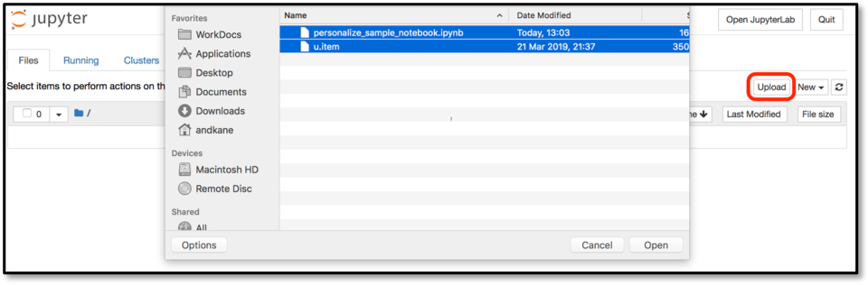

3. Click on each of the two **Upload** buttons to actually upload the files, waiting for the first to complete before starting the second.

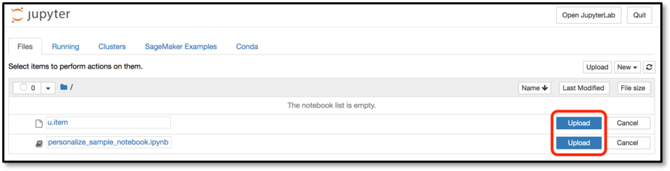

4. Once both are upload you can click on the notebook **.ipynb** file and the lab notebook will open, and you can now begin to work through the lab notebook.

### Working Through a Jupyter Notebook

1. A notebook consisted of a number of cells; in SageMaker these will typically either be _Code_ or _Markdown_ cells.  Markdown is used to allow for documentation to be defined inline with the code, giving the author a rich set of markdown formatting options.  The first cell in this notebook, which is called **Get the Personalize boto3 Client**, is Markdown, and if you select any cell then the whole cell is highlighted.


2. The first Markdown cell describes what the following Code cell is going to do – for the sake of this lab you do not have to understand the code that is being run in the Code cell, rather you should just appreciate what the notebook is doing and how you interact with a Jupyter notebook.


3. To the left of a Code module is a set of empty braces **[ ]**.  By highlighting the cell and then selecting the _Run_ command in the menu bar, the Jupyter notebook will execute this code, outputting and code outputs to the notebook screen and keeping any results data internally for re-use in future steps.  Do this now to execute the first code cell.

*Note: if a Markdown cell is highlighted, then clicking **Run** will move the highlight to the next cell*

3. Whilst the code is executing the braces will change to be **[\*]**, indicating that it is executing, and once complete will change to **[1]**.  Future cells will have increasing numbers inside the braces, and this helps you see the order in which cells have been exected within the notebook.  Directly below the code, but still within the Code cell, is the output from the code execution - this will include any error messages that your code has thrown.  In this example, the code execurion successfully created the specified bucket in S3.

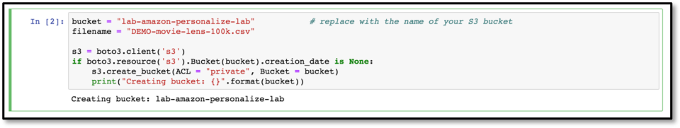

5. Now please continue to work through the notebook lab - read the comments prior to each Code cell in order to get an understanding as to what is going on, as these explain why we are doing each step and how it ties in to using the Amazon Personalize service.

# Creating Parallel Solutions

## Create Item-to-Item Similarities Solution

1. Using the same methods as before, go to the Services drop-down in the console and navigate to the **Amazon Personalize** service in another tab, and select **Dataset groups**.  You will see the dataset group that you created earlier, and click on the name of your dataset group.

    

2. The left-hand side, which will show you the solution that you're currently creating via your notebook.  Then, select **Solutions and recipes**, then click on the **Create solution** button.

   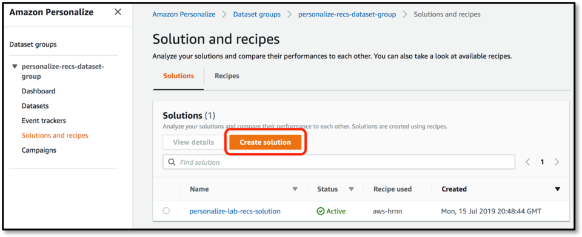

3. Enter a suitable name for this solution, such as *similar-items-solutions*, select **Manual** recipe selection, then choose the **aws-sims** recipe and click **Next** - we don't need to change anything in the advanced configuration section

   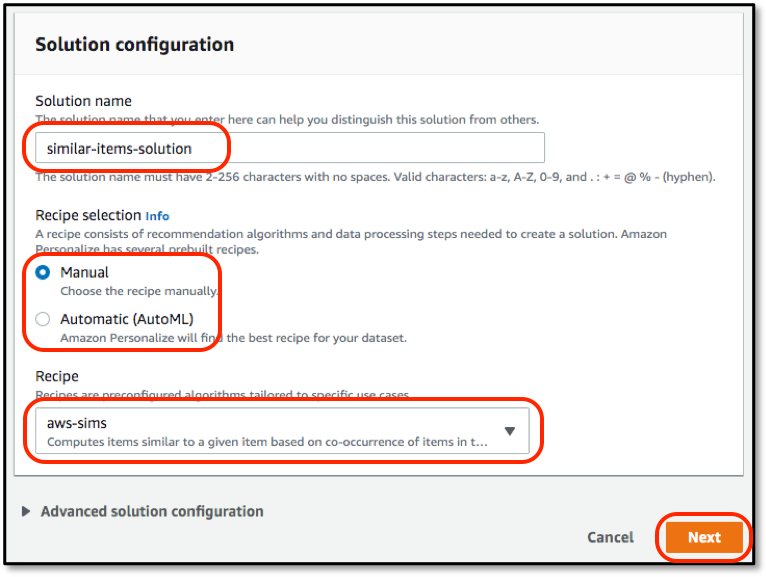

4. In the following screen just hit the **Finish** button and a new solution version will start to be created.

   

## Create Personal Ranking Solution

1. Let's do exactly the same thing again, but this time we'll create a ranking solition.  From the **Solutions and Recipes** screen that you are on, click **Create solution**, give it a name like *rankings-solution*, ensure it's a **Manual** recipe selection but this time select the **aws-personalized-ranking** recipe.  Click **Next** and **Finished** as before

   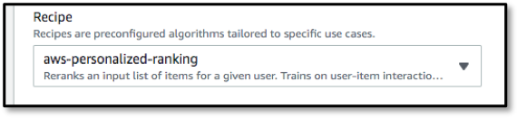

2. You now have three solutions being built off of the same dataset, and all three will slot into the application later.  Please now go back to the notebook and continue to build your recommendation campaign and do some quick testing - if the notebook solution still hasn't completed then you may continue with the first part of the next section, **Finalise Django Framework Configuration**

# Using the Video Recommendation App

#### Notes on the Application

1. The RDS database is postgres, and we have included the **pgcli** tool with this deployment, as you may wish to look at the database schema structure, examine the data that was in the RDS snapshot, or potentially update this all after you have customised the Django application for your own needs.  There is a startup script for this in the **/home/ec2-user/personalize-video-recs/videorecs/** folder, which is the root of the whole Django framework application.
2. **CURRENT BUG** - when the CloudFormation template is complete there is a running web-application, but for some (currently unknown) reason it fails its health check.  However, SSH'ing into the instance will show the web-server job running, configuration is correct, etc.  If you get a *Bad Gateway* error when you navigate to the application, please terminate the EC2 instance - auto-scaling will bring another back to life, which always seems to be fine.

## Running the Video Recommendation App

1.  The application server should already running running.  You can find the two URLs required for different aspects of the app in the CloudFormation outputs panel.

   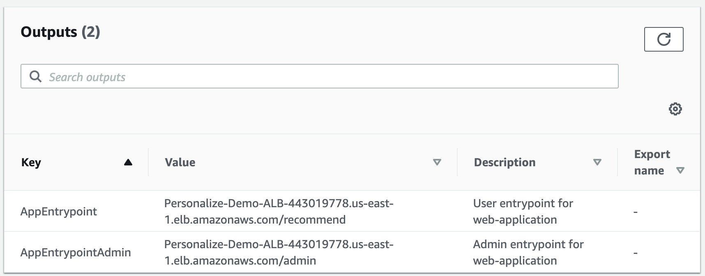
   
2. The URL of the application is your ALB followed by the **/recommend/** path, although there is also an **/admin/** path configured that we'll use later.  For now connect to your application using the *AppEntrypoint* URL

3. You should see the following screen in your browser - no *Model Precision Metrics* are available, as we haven't added any models yet to the application.  You can also see that documentation for this is present, but be aware that it may not be 100% up to date with coding changes on the demo.

   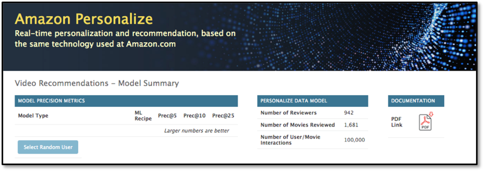

4. If you hit **Select Random User** then you'll be taken to the main Recommendation screen, which starts by showing you a random user's top-25 movie review titles.  However, you'll see on the Model dropdown on the left that there are no models available, and if you change the Personalize Mode to either Personal Ranking or Similar Items then it's the same story - you can see the movie reviews, and most-popular titles in a genre, but no recommendations.  We need to get the solutions and campaigns built in the notebook, then you can come back and plug in the models.

   

At this point we require the solution that is being built in the notebook to complete and the associated campaign to have been created - until that time we cannot move forward, so you may wish to get some refreshments if you are still waiting for those two steps to complete.

## Create Additional Personalize Campaigns

If you have built the additional two Personalize models, for Item-to-Item Similarities and Personal Rankings, then you'll need to create the associated campaigns for these solutions, as it is the campaigns that we will add to the application.  If those solutions have been built then continue with these steps, but if not you can always come back to these steps later before adding them to the application.

1. In the AWS Console, go to the **Amazon Personalize** service console, click on **Dataset groups** link on the left-hand menu, and select the **personalize-recs-dataset-group** link, then click into the **Campaigns** menu item on the left.  Select **Create campaign**

   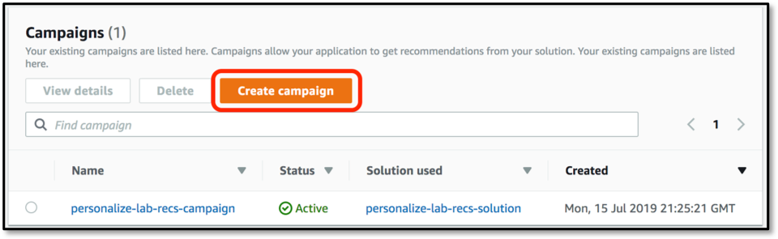

2. First, we want to build the campaign for the *Similar Items* model - enter a name for the campaign, such as *similar-items-campaign*, select via the drop-down that solution that you previously built in the console, *similar-items-solution*, and ensure that minimum TPS is set to 1.  Hit **Create campaign**

   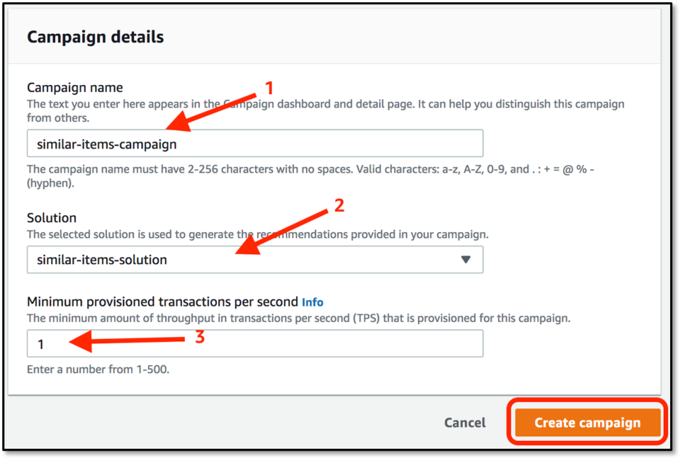

3. Now build the campaign for the *Personal Rankings* model - follow the same steps as before, but this time use *rankings-campaign* for the campaign name and select the *rankings-solution* model in the drop-down control.

## Plug In the Recommendation Model(s)

The application uses the Django Administration feature to define models that are available to the application.  This allows multiple models of different types to be configured, and injected or removed from the application at any time.  There are three modes of operation of the application:

- **Recommendations** - standard recommendations, allowing different 2 models to be compared at once
- **Personal Ranking** - re-ranks popular films in a genre, with a single model on-screen at once
- **Similar Items** - shows items similar to others, with a single model on-screen at once.  You can optionally send this list through a *Personal Ranking* model if you have one defined

Each of these modes allows multiple models of their type to be used, but each mode can only show one or two different models simultaneously - however, you can choose any configured model at any time.

1. Login to the Django Administration site.  This is at the same URL as the main application, but replace **/recommend** with **/admin** at the end of the URL, as shown previously in the CloudFormation Outputs panel.  This will bring up the following screen, so login now with the credentials that you supplied when you ran the CloudFormation template:

   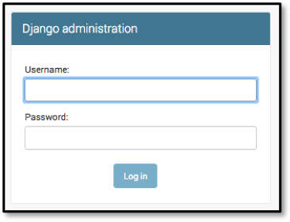
   
3. This brings up the *Site Administration* screen, which show entries for Groups and Users (which we don't need), but also a section called **Recommend** where you can add **Personalize models** to the app.  Click on **+Add** link to begin to add a new model

4. Back on the AWS Console, go to the **Amazon Personalize** service console, select the **personalize-recs-dataset-group** and then on the left-hand menu click **Campaigns**.  This will show your **personalize-lab-recs-campaign**, along with the campaigns for the other two solutions if you've created them.  If you've created all three then you should see something like this, but for your other two campaigns may already have been created

   

5. Click on the **personalize-lab-recs-campaign** and you'll see the **Campaign ARN** - copy this, and head back to the admin screen.  Enter **Personal Recommendations** for the model name, enter the ARN where it asks, ensure that the **Model type** is set for recommendations and set the **Model sort order** to 1.  Click on **SAVE** to save the definition.

   

6. The application will use the sort order field to decide how to order models in the on-screen drop-downs.  Only models of the right type are shown on the relevant screen, but there is no validation that you have entered the correct model type, and if you put a SIMS model on the Rankings screen then the application will throw errors.

7. If you also have a SIMS or Personal Ranking campaign then go ahead and add them now in the same way - if they haven't yet completed then you can come back and add them later.  You can then close the admin screen and head back to the main application web page

8. The main screen now shows the three models (or maybe just one) that we've built - it lists the precision metrics for each one, and as you add or remove models from the Django Administration page the changes will be reflected here.  Now click on the **Select Random User** button

   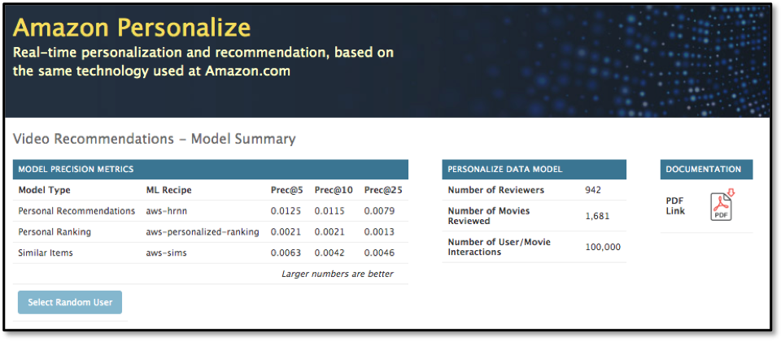

9. The screen will look as before, but now if you click on the **Model 1** drop-down you will see that our one Recommendation model is present - if you select it then the screen will refresh to show recommendations for this user using that model.

   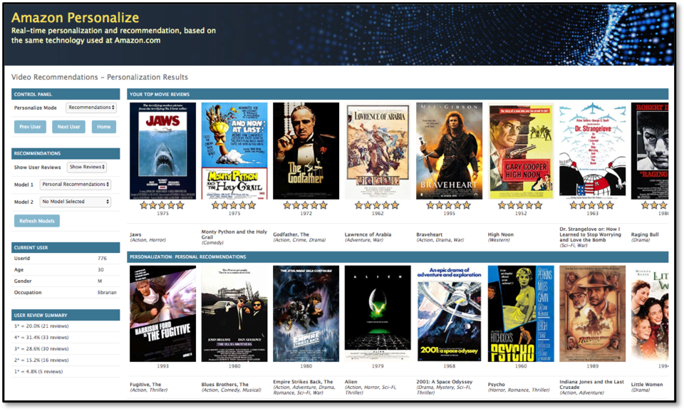

10. You can step through users to see how these look for different demographics of users.  If you had mutiple Recommendation models defined then they would also be in the two model drop-downs, and you'd be able to show two completely different recommendation models, based upon different user demographic or item metadata, allowing you to compare and contrast different approaches.

11. Try out the **Personal Ranking** personalize mode - this takes a list of the most popular movies in the dataset, either as a whole or in just a single genre.  This will take that list and re-rank it into an order for this particular user, ensuring that the ones that are most likely to be interested in are shown first.

12. Finally, try the **Similar Items** personalize mode - this starts with the user's top-ranked film, and finds a list of films that people who watched this also watched.  This is done without reference to the user's preferences, and the list is generated based upon what's in the dataset as a whole.  However, if you also have a **Personal Ranking** model defined then the **Ordering** drop-down will re-rank this list into one that is more suited to the user's preferences.

## Additional Campaigns to Build

If you look at the embedded documentation you'll see that it talks about 3 other models, which there isn't time to build during this Lab.  They involve the user of additional data files - a user demographic file, and a item metadata file, all of which are supplied with the Movie Lens data set in your Sagemaker Notebook.  Because they required additional data-sets, you need to create each of these within their own Personalize Dataset Group, and you also need to re-import the original interactions file **DEMO-movie-lens-100k.csv** that you uploaded into S3 during the notebook - this is because Personalize trains solutions on all data files witin the Dataset Group.

The three models that you should build are as follows:

- Using a USERS file, create a model that takes into account user's demographic details such as age, gender and occupation
- Using an ITEMS metadata file, create a model that also takes into account the movie year and the top-4 genres associated with that movie as 4 separate metadata fields
- Using an ITEMS metadata file, create a model that also takes into account the movie year and then compounds the top-4 genres into a single metadata field

Observations are that demographics are absolutely not a good indicator for movies recommendations, nor for things like book recommendations - this isn't an issue with Amazon Personalize, rather it is a know issue with using age and gender to predict likes and dislikes of media.  Also, the single, compound genre certainly seems more accurate for the first 5 or 10 responses, but for the set of 25 response as a whole the multiple genre model probably gets a better list of movies than the compound one.

# Closing Down Your Resources

## Terminating the Notebook Instance

1. Open the Amazon SageMaker console and click on **Notebook instances**
2. Find the notebook instance listed as _[Name]-lab-notebook_, select its radio button and then click the **Actions** dropdown.

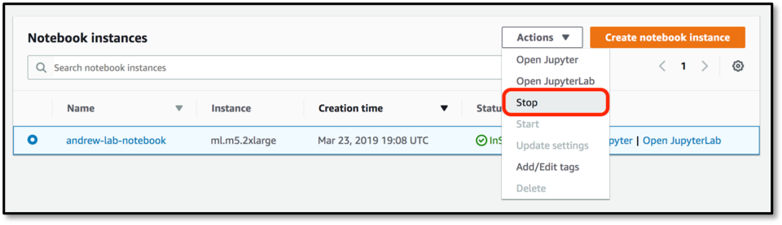

3. Click **Stop** to stop the Notebook Instance.  This does not delete the underlying data and resources.  After a few minutes the instance status will change to _Stopped_, and you can now click on the **Actions** dropdown again, but this time select **Delete**.

Note that by selecting the name of the Notebook instance on this dialog you are taken to a more detailed information page regarding that instance, which also has **Stop** and **Delete** buttons present – notebooks can also be deleted using this method.

## Conclusion

Upon completion of this lab you will have performed the following:

- Launched a Jupyter notebook from with the Amazon SageMaker service
- Imported external files into the notebook environment
- Seen how to enable Preview services within a notebook (assuming your account has been whitelisted for Preview access)
- Used the **pandas** libraries to do some pre-processing of the source data
- Built and deployed an ML model based upon the HRNN algorithm
- Tested your model via just a few lines of code
- Deployed your model into a live application

You should now be able to embed this model from within your own application code, using any language that is supported by the AWS SDK.  Happy recommending!
