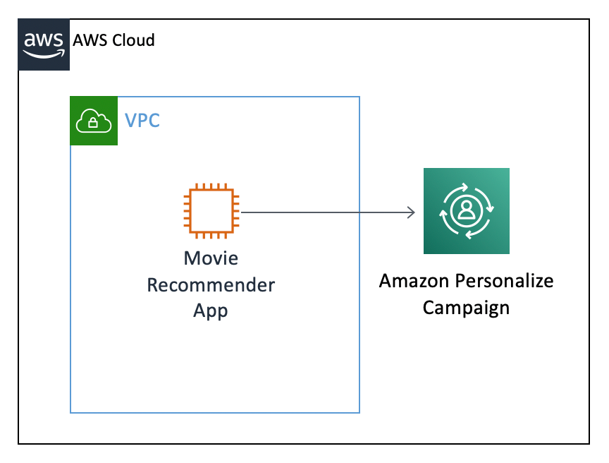
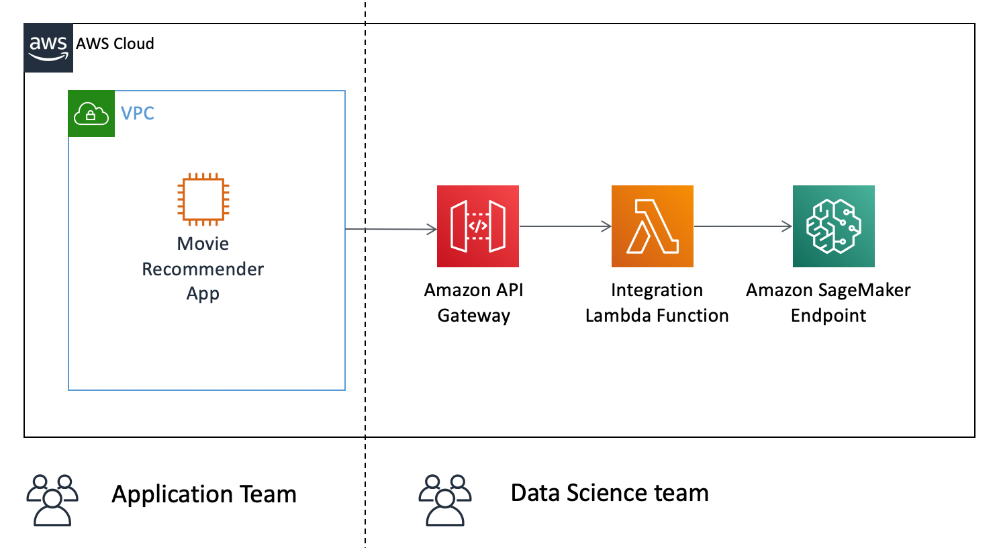
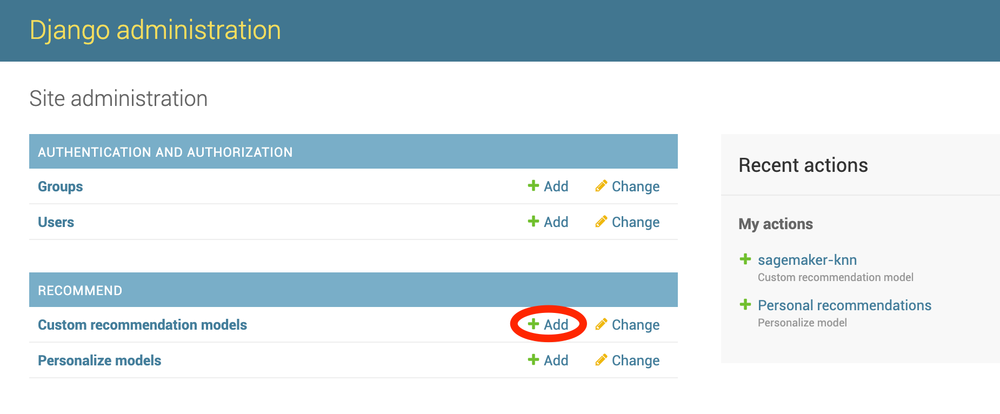
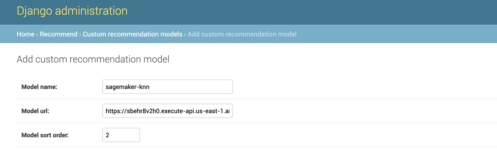
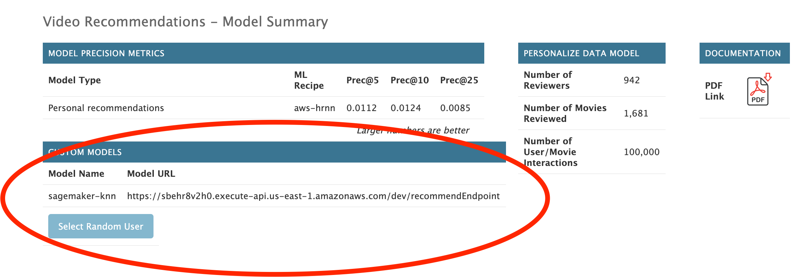
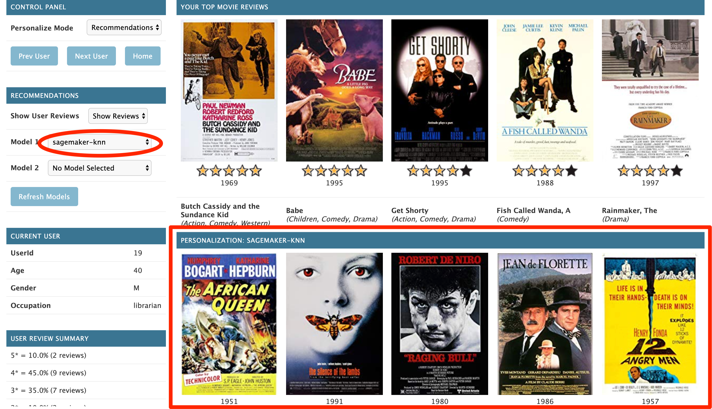

 

# Lab 2 - Training and deploying a custom recommender model using Amazon SageMaker

## Overview

In the previous lab we have trained custom recommendation models using Amazon Personalize and integrated this into our movie recommendation application.

Following figure shows a simplified architecture of this application:



Now your startup has become very successful, you where able to hire a team of data scientists. This team consists of experts on recommender systems who want to have more control over the entire machine learning workflow.

To accommodate this we will use [Amazon SageMaker](https://aws.amazon.com/sagemaker/) in this lab.
Amazon SageMaker is a fully-managed service that covers the entire machine learning workflow to label and prepare your data, choose an algorithm, train the model, tune and optimize it for deployment, make predictions, and take action. It allows full flexibility on which machine learning framework to use and also offers built-in algorithms for various use cases.

Throughout this lab we will:

- Train a custom machine learning model based on Amazon SageMaker Built-in algorithms
- Deploy this model via a SageMaker Endpoint
- Integrate this endpoint into the Movie Recommender App using Api Gateway and a Lambda function

The final architecture will look like this:

.

## Training and deploying a custom recommendation model

1. Navigate to Amazon SageMaker service in the AWS Console --> Select `Notebook instances`
1. Select `Open JupyterLab` for your notebook instance to navigate back to the JupyterLab web interface.
1. In the file browser select `lab-2-recommendations-with-sagemaker` and open the notebook --> `1-Training-and-deploying-your-recommendation-model.ipynb`

Now slowly work through the notebook to train and deploy your first machine learning model.

## Deploying the integration lambda function

If you followed the notebook closely, you might have noticed that we have deployed an endpoint which takes a user embedding (simple vector) as input. The user embedding identifies the user and the endpoint returns a list of recommended movie ids in following format

```json
{'distances': [2.964694738388061,
  2.967271327972412,
  2.976406097412109,
  2.978152751922607,
  ....,
  5.529520988464356,
  6.034342765808105],
 'labels': [527.0,
  732.0,
  484.0,
  56.0,
  ...,
  50.0,
  64.0],
 'predicted_label': 1.0}

```

This is not ideal for our recommendation app. The movie recommendation application requires a simple REST endpoint which takes a userId as request parameter like this:

`https://endpointurl/recommendEndpoint?user_id=3`

and returns a JSON based list of user id, similar to this:

```json
{"movies": [814, 1125, 653, 428, 1525, 60, 652, 185, 654, 86, 223, 12, ...]}
```

To solve this we will create a Lambda function to integrate both. The Lambda function transforms a given user id into a user representation required by the SageMaker endpoint. It will then call the endpoint using the AWS SDK and return a list of recommended movies in the required format. The Lambda function will be fronted by a API Gateway.

This is a typical architecture in a microservice based environment. This approach has following advantages:

- A stable contract between the parts of the application owned by the application development team and the data science team
- The data science team can easily experiment with new models and change the backend architecture without impacting the business application by simply changing the endpoint of the API Gateway.

1. To create the required Lambda Function and API Gateway open the notebook `2-Integrating-your-endpoint-with-lambda.ipynb` and work through each of the steps.

## Integrating the endpoint into the movie recommender app

Now that we have a working REST based endpoint, we are missing only the final step. We need to make sure the movie recommender app calls our endpoint.
Thankfully the application development team made this configurable for us:

1. Login to the Django Administration site. This is at the same URL as the main application, but replace **/recommend** with **/admin** at the end of the URL, as shown previously in lab 1 in the CloudFormation Outputs panel. This will bring up the following screen, so login now with the credentials that you supplied when you ran the CloudFormation template (Not you might still be logged in and can skip the login screen):

   

1. This brings up the _Site Administration_ screen, which show entries for Groups and Users (which we don't need), but also a section called **Recommend** where you can add **Custom recommendation models** to the app. Click on **+Add** link to begin to add a new model

   

1. Now type in a name of your choice into the name field e.g. `sagemaker-knn`
1. For `model url` provide the URL of the Lambda endpoint. This was the URL of the endpoint which you had to note down in the last notebook.
1. For `Model sort order` type in `2``

   

1. Now hit `save`to store the model configuration

1. Switch back to the movie recommender app by replacing **/admin** with **/recommend** in the URL.
   You should now see the model configuration on the welcome page:
   

1. Now select a user of your choice and you should be able to select the new model in the dropdown and see recommended movies.

   

## Congratulations

You have now successfully trained deployed and integrated your first model with Amazon SageMaker. Feel free to play around with the application and explore the building blocks further in the AWS console e.g. SageMaker, Lambda function, API Gateway, etc..

Of course there is a lot you can do from here to extend this further e.g.

- we have not evaluated our model against a test set yet, you should compute similar metrics based on a test set as for the personalize models to compare these models
- Instead of using the built-in algorithms you can train your own custom model based on a framework of your choice
- The process of model training and deployment should be fully automated using a CI/CD pipeline (MLOps)
